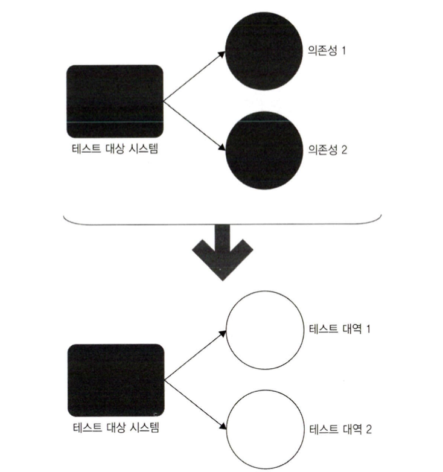
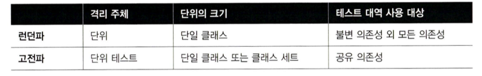
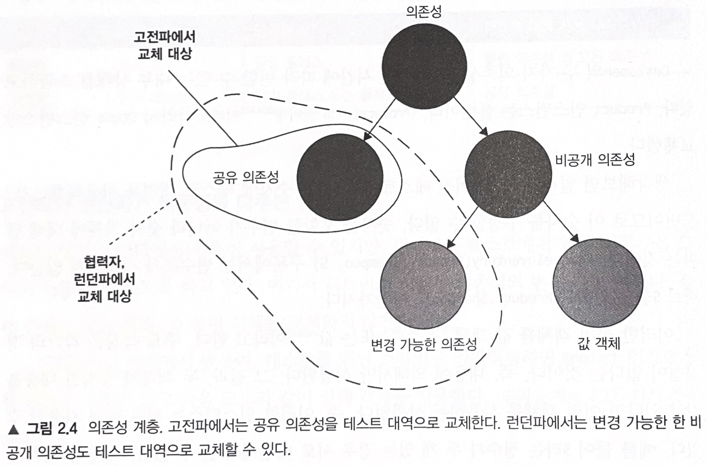

단위 테스트란 무엇인가
=============

# 1. 단위테스트의 정의

단위 테스트란
1. 작은 코드 조각을 검증하고
2. 빠르게 수행하고
3. 격리된 방식으로 처리하는 자동화된 테스트다

첫번째와 두번째는 이견이 없는 사항이지만, 세번째에 대해서는 여러 의견이 있다.
정확히는 격리를 무엇으로 해석하느냐에 대해 의견이 분분하다.

## 테스트 방식에 대한 접근

런던파에서는 격리된 방식으로 검증을 테스트 대상 시스템을 협력자에서 격리하는 것으로 해석한다.
하나의 클래스가 다른 클래스에 의존하면 모든 의존성을 테스트 대역으로 대체해야 한다.



간단하게 말하자면 테스트를 작성하기 위해 특정 의존성을 직접 불러올 필요 없이, 대역을 작성하면 해당 의존성이 어떻게 바뀌든 신경쓰지 않아도 된다.

PS) 의존성이란? 간단하게 말하자면 테스트 대상인 코드가 외부 요소나 다른 코드 모듈에 의존하는 걸 말함.(Math라이브러리나 다른 클래스)

이러한 의존성 격리를 사용하면 단순히 클래스에 해당하는 단위 테스트 클래스만 생성하면 된다.

예를 들어 보자

상점에 재고가 충분히 있을때만 구매가 성공하는 검증이다.

준비 - 실행 - 검증 패턴이다.

```
public void Purchase_fails_when_not_enough_inventory()
{
	//준비
    var store = new Store();
    store.AddInventory(Product.shampoo, 10);
    var customer = new Customer();
    
    //실행
   	bool success = customer.Purchase(store, Product.Shampoo, 15);
    
    //검증 (실패 했기에 수량 변화가 없음)
    Assert.False(success);
    Assert.Equals(10, store.GetInventory(Product.Shampoo));
 }
```

준비 단계를 보면 테스트 대상 시스템인 고객과 협력자인 상점을 준비한다.

이 코드는 고전 스타일로써 협력자를 대체하지 않고 운영용 인스턴스를 사용한다. 그런데 테스트 대상 시스템은 고객이지만, 상점에 문제가 있다면 단위 테스트의 결과가 실패이다.

테스트에서 두 클래스는 격리돼 있지 않다.

이제 런던 스타일을 보자.

```
public void Purchase_fails_when_not_enough_inventory()
{
	//준비
    var store = new Mock<IStore>();
    storeMock
    	.Setup(x => x.HasEnoughInventory(Product.Shampoo, 5))
        .Return(false)
    var customer = new Customer();
    
    //실행
   	bool success = customer.Purchase(storeMock.Object, Product.Shampoo, 5);
    
    //검증 (실패 했기에 수량 변화가 없음)
    Assert.False(success);
    storeMock.Verify(
    	x => x.RemoveInventory(Product.Shampoo, 5),
        Times.Never);
 }
```

런던 스타일은 준비 단계에서 테스트 대역을 준비한다. 협력자가 어떻게 응답해야하는지 직접 정의한다.
Store의 실제 상태와 관계없이 테스트가 요구하는 방식으로 응답한다.

검증 단계 또한 이전과 같이 호출에 대한 결과를 확인하지만, 고객이 상점에서 올바르게 확인하는 방법이 다르다.

지금은 Customer와 Sotre간의 상호 작용을 검사한다. 고객이 상점에서 호출을 올바르게 했는지 확인한다. 마지막에는 메서드와 호출 횟수까지 검증 한다.

```
PS) 자세히 보면 HasEnoughInventory에서 return false를 반환하도록 설정했음. 샴푸의 충분한 재고가 없는 상태임. 그러니 customer.Purchase는 false를 반환해야하며 RemoveInventory는 호출되지 않아야함.

Times.Never = 메소드가 호출되지 않았는지 확인할때 사용

다시 정리하자면 협력자에서 내부 로직 상 RemoveInventory가 실행되지 않도록 세팅해놓았으니 RemoveInventory가 진짜로 실행되지 않았는지 마지막에 테스트 해주는것.
```

## 격리 문제에 대한 고전파의 접근

런던 스타일은 테스트 대역으로 테스트 대상 코드 조각을 분리해서 격리 한다. 그렇다면 무엇이 작은 코드 조각에 해당하는지도 정의해야한다.

단위 테스트의 속성은
- 작은 코드 조각 검증
- 신속하게 수행
- 격리된 방식 진행

세번째 속성에 대한 해석도 분분하지만 첫번째 속성도 사실 다양한 해석이 가능하다. 코드 조각이 얼마나 작아야하는지 말이다. 

각각의 모든 클래스를 격리해야한다면 테스트 대상 코드 조각은 단일 클래스거나 해당 클래스내의 메서드 여야 한다. 격리 문제를 고려하면 일반적으로 한번에 한 클래스로 테스트하는 지침을 따르는 것이 좋다.

그러나 고전적인 방법에서는 코드를 꼭 격리하는 방식으로 테스트하지 않아도 된다. 대신 단위 테스트는 서로 격리해서 실행해야한다.

이게 무슨말이냐면 여러 클래스가 모두 메모리에 상주하고 공유 상태에 도달하지 않는다면 여러 클래스를 한번에 테스트해도 된다.

예를 들어 준비 단계에서 DB에 고객을 생성하고 -> 이 테스트가 실행되기 전 다른 테스트 준비단계에서 고객을 삭제할 수도 있다. 이게 병렬로 실행하면 첫번째가 실패하지만 이는 제품 코드의 문제라기보단 두번째 테스트의 간섭 때문이다. (공유 의존성)


- 공유 의존성 = 테스트 간의 공유되고 서로의 결과에 영향을 미칠 수 있는 의존성(가변필드)
- 비공개 의존성 = 공유하지 않는 의존성
- 프로세스 외부 의존성 = 애플리케이션 실행 프로세스 외부에서 실행되는 의존성, 아직 메모리에 없는 데이터.

고전파는 이러한 의존성들 중에 테스트 간에 공유 상태를 의존성에 대해서만 테스트 대역을 사용한다.

공유 의존성의 경우 테스트 대상 클래스 간이 아니라 단위 테스트 간에 공유한다. 제품 코드가 싱글턴으로 개발되어 있다해도 테스트 코드는 이 패턴을 따르지 않는다.(테스트의 독립성이 침해 받을 수 있어서)

예를 들어 데이터베이스나 파일 시스템등은 공유 의존성이기 때문에 교체하지만 단순히 다른 클래스는 비공개 의존성을 유지한다.

- 공유 의존성과 휘발성 의존성
  - 휘발성 의존성이란 시스템에 기본적으로 설치되어 있지 않고, 난수 생성기나 날짜 등을 반환하는 기능을 하는 각 호출에 대해 다른 결과를 제공하는 의존성을 얘기한다.
  - 공유 의존성과 단위 테스트가 실행 컨텍스트를 서로 방해할 수 있는 수단이 되기도 하므로 겹치는 부분이 있다.

결론은 공유 의존성을 대체해야한다는거다.

그러나 격리에 대해서는 여전히 런던파와 견해가 다르다. 단위가 반드시 클래스에 국한되지 않아도 된다. 공유 의존성이 없는 한 여러 클래스끼리 묶어서 단위 테스트를 할수도 있다.

# 2. 단위 테스트의 런던파와 고전파

두 파를 나누는 주요 요소
- 격리 요수 사항
- 테스트 대상 코드 조각의 구성요소
- 의존성 처리




## 런던파와 고전파가 의존성을 다루는 방법



테스트 대역을 어디에서나 사용할 수 있지만 런던파는 일부 의존성(불변 객체)만 그대로 사용할 수 있도록 하고 있다.

예를 들어

```
var storeMock = new StoreMock<IStore>();

bool success = customer.Purchase(storeMock.Object, Product.Shampoo, 5);
```

enum인 Product.Shampoo와 숫자 5는 테스트 대역을 사용하지 않았다.

요약하자면 고전파에서는 공유 의존성만을 테스트 대역으로 교체하지만, 런던파에서는 변경 가능한 비굥개 의존성도 테스트 대역으로 교체할 수 있다.

추가적으로

외부 API를 호출하는게(프로세스 외부 의존성) 늘 공유 의존성은 아닌게 조회 외부 의존성이라면, 호출이 해당 API의 응답에 어떤 영향도 미치지 않기 때문에 이는 실행 컨텍스트에 영향을 주지 않았으니 런던파 테스트에서도 목으로 대체하지 않아도 된다고 보는 것이다.

- 공유 의존성 : 여러 테스트 간에 상태가 공유되는 의존성. 테스트 간에 서로 영향을 줄 수 있기 때문에, 격리가 중요
- 프로세스 외부 의존성은 테스트가 실행되는 프로세스 바깥에 있는 의존성. 모든 프로세스 외부 의존성이 공유 의존성은 아님.


## 고전파와 런던파의 비교

필자는 고전파 테스트가 고품질의 테스트를 만들고, 단위 테스트로 인해 지속 가능한 성장에 적합하다고 봤다.

런던파는 목을 사용하기에 고전파에 비해 불안정하다는 취약성이 있다. 그럼에도 장점은 이러하다.

- 입자성이 좋다. 한번에 한 클래스만 확인하니까
- 서로 연결된 클래스의 그래프가 커져도 테스트하기 쉽다.
- 어디서 실패했는지 알기 쉽다.

## 한번에 한 클래스만 테스트

좋은 코드 입자성을 목표로 하지 말자. 테스트는 코드의 단위를 검증하기 보다는 동작의 단위를 검증해야한다.
그렇게해야 이 테스트가 왜 유효한지, 무엇을 검증하는지 이해하기가 쉬워지기 때문이다.

그러니까 

강아지가 나에게 온다.

라는 테스트는 목적이 명확하다.

그러나 강아지가 앞다리를 움직이고, 뒷다리도 움직이고 꼬리도 흔들고

이런식으로 테스트하면 그래서 테스트가 뭘 하고자하는건지 아무도 이해하지 못한다.

## 그외의 다른 차이점

- 테스트 주도 개발을 통한 시스템 설계 방식
- 과도한 명세 문제

런던파는 하향식 TDD이며 전체 시스템에 대한 기대치를 설정하는 상위 레벨 테스트 부터 시작한다. 목이 있기때문에 한번에 하나씩 작업해도 된다.


1. 전체 시스템에 대한 기대치를 설정하는 상위 레벨 테스트부터 시작한다.
2. 목을 사용해 예상 결과를 달성하고자 시스템이 통신해야 하는 협력자를 지정.
3. 모든 클래스를 구현할 때까지 클래스 그래프를 다져나감

고전파는 실제 객체를 다뤄야 하기 때문에 런던파와는 다르게 일반적으로 상향식으로 한다. 

고전파와 런던파 간의 가장 중요한 차이점은 과도한 명세 문제, 즉 테스트가 대상의 구현 세부 사항에 결합되는 것이다.
런던 스타일은 고전 스타일보다 테스트가 구현에 더 자주 결합되는 편이다.

## 두 분파의 통합 테스트

런던파는 실제 협력자 객체를 사용하는 모든 테스트를 통합 테스트로 간주한다.
고전 스타일로 작성된 대부분의 테스트는 런던파 지지자들에게 통합테스트로 느껴질 것이다.

- 런던파
  - 작은 코드 조각을 검증하고, 빠르게 수행하고, 격리된 방식으로 처리한다.
- 고전파
  - 단일 동작 단위를 검증하고, 빠르게 수행하고, 다른 테스트와 별도로 처리한다.

둘 이상의 동작 단위를 검증할때의 테스트는 통합 테스트다. 다른 동작 단위를 검증하는 느린 테스트가 두개 있다면, 하나로 합치는게 좋다.

## 통합 테스트의 일부인 엔드 투 엔드 테스트

간단히 말해 통합 테스트는 공유 의존성, 프로세스 외부 의존성뿐 아니라 조직 내 다른 팀이 개발한 코드 등과 통합해 작동하는지도 검증하는 테스트다. 엔드 투 엔드 테스트는 통합 테스트의 일부다.

통합 테스트와 엔드 투 엔드 테스트의 차이점은 일반적으로 엔드 투 엔드 테스트가 의존성을 더 많이 포함한다는 것이다.

**엔드 투 엔드**라는 명칭은 모든 외부 애플리케이션을 포함해 시스템을 최종 사용자의 관점에서 검증하는 것을 의미한다.

엔드 투 엔드 테스트를 하더라도 모든 프로세스 외부 의존성을 처리하지 못할 수도 있다.
일부 의존성의 테스트 버전이 없거나 해당 의존성을 필요한 상태로 자동으로 가져오는 것이 불가능할 수 있다.
여전히 테스트 대역을 사용할 필요가 있고, 통합 테스트와 엔드 투 엔드 테스트 사이에 뚜렷한 경계가 없다는 사실을 강조한다.