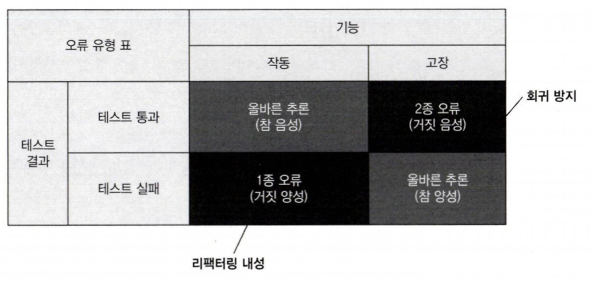
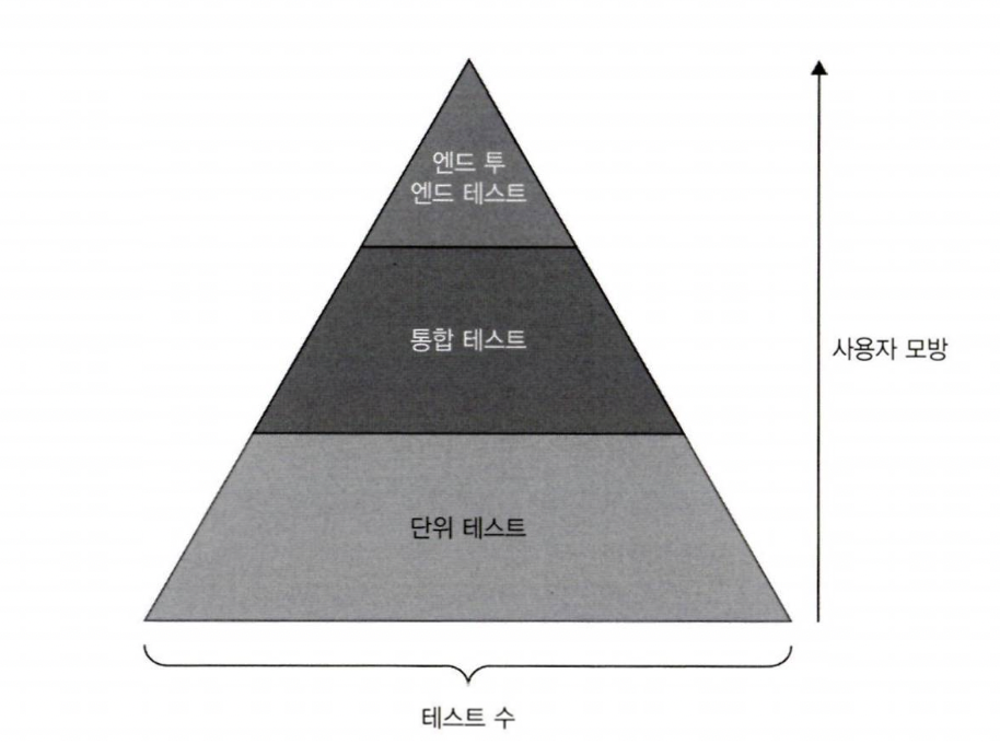
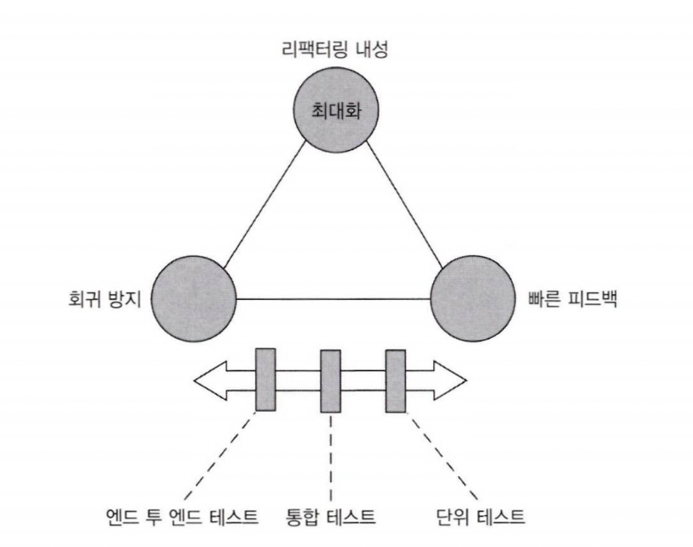
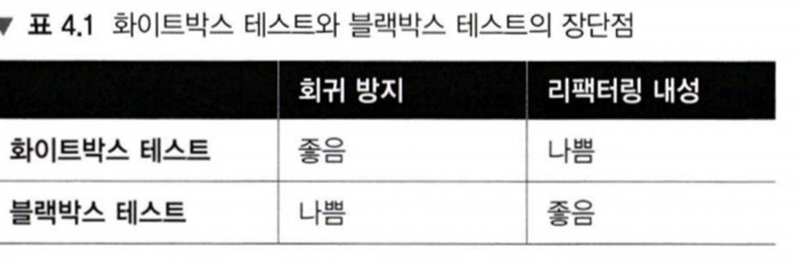

좋은 단위 테스트의 4대 요소
=============


# 1. 좋은 단위 테스트의 관점 간 차이점

좋은 단위 테스트의 네가지 특성
- 회귀 방지
- 리팩터링 내성
- 빠른 피드백
- 유지 보수성

## 1-1. 회귀 방지

회귀 = 소프트웨어 버그, 코드를 수정한 후 기능이 의도한대로 작동하지 않는 경우
그러니까 코드가 늘어나면 날수록 책임이 커지고 잠재적인 버그에 더 많이 노출된다. 이러한 회귀(버그)에 대해 대비해야함.

회귀 방지 지표에 대한 고려 사항
- 테스트 중에 실행되는 코드의 양 -> 일반적으로 코드가 많으면 버그도 많이 생김
- 코드 복잡도 -> 복잡한 비즈니스 로직을 품은 코드가 여기저기 복붙된 코드보다 중요하다. 버그가 발생하면 크리티컬하기 때문
- 코드 도메인의 유의성 -> 이하 동문.

이러한 코드들 외에도 라이브러리나 프로젝트 외부 시스템도 버그방지를 위해 고려해야한다. 이또한 테스트 범주에 포함시켜 의존성에 대해 검증해야한다.

+) 회귀(Regression)는 소프트웨어 개발에서 이미 정상적으로 동작하던 기능이, 새로운 코드 변경이나 업데이트 후에 의도치 않게 오작동하거나 오류가 발생하는 상황을 의미

## 1-2 리팩터링 내성

리팩터링 = 동작은 그대로 두되, 비기능적 특징을 개선하는것 (* 비기능이라함은 소프트웨어가 효율적으로 작동하게 하는 것)  
이때 리팩터링 내성은 리팩터링을 하더라도 테스트가 실패하지 않는것을 말한다.

단위 테스트의 목표는 버그없이 주기적으로 리팩터링을 할 수있고 새로운 기능을 추가하는것임. 그렇기에 거짓 양성(= 기능은 동작하나 테스트는 실패)이 발생하지 않도록 잘 작성해야한다.

거짓 양성이 지속적으로 발생하면
- 리팩터링하고자하는 의지가 떨어지며
- 정말로 문제가 있어도 테스트 자체의 문제라고 치부하며 문제를 무시하게 된다

결국 거짓 양성이 발생하는 원인을 파악하고 거짓 양성이 발생하는 상황을 줄여야한다!

거짓 양성은 어떨때 발생할까?
- 테스트 대상 시스템과 구현 세부 사항의 결합도가 높을때 -> 구현부분과 테스트를 분리해야한다.
최종 사용자의 관점에서 테스트 대상 시스템을 검증해야한다. 그리고 의미있는 결과만 확인해야한다.(나머지는 무시해도됨)

그래서 테스트를 어떻게 구성해야할까? 문제 영역에 대해 집중하자.

(이건 직접 생각해본 예제임)

```
// TokenService 클래스
public class TokenService {
    public String generateToken(User user) {
        // 실제 토큰 생성 로직 (여기서는 단순히 사용자 ID를 사용한 예제)
        String token = "Bearer " + Base64.getEncoder().encodeToString(user.getId().getBytes());
        return token;
    }
}

public class TokenServiceTest {
    @Test
    public void testGenerateToken() {
        User user = new User("123", "John Doe");
        TokenService tokenService = new TokenService();
        String token = tokenService.generateToken(user);

        // 단순히 "Bearer "가 붙어 있는지만 확인
        assertTrue(token.startsWith("Bearer "));
    }
}
```
예를 들어 토큰이 제대로 생성되는지 동작하려 검사하는 로직이 있다고 치자.
단순히 Bearer가 앞에 붙어있다면 토큰이 제대로 생성됐다고 판단한다. 이러면 암호화 방식이 바뀌었을때도 여전히 토큰을 제대로 생성하는지 검사하는데도 거짓양성(버그라고 판단하는 경우)가 발생한다.
이런 경우 SUT가 구현 세부 사항과 결합했다고 볼 수 있다.

리팩터링 과정은 애플리케이션의 동작에 영향을 주지 않으면서 구현을 변경해야한다. 그러기 위해서는 *구현 세부 사항 대싱 최종 결과를 목표로 해야한다.* 

```
public class TokenServiceTest {
    @Test
    public void testGenerateToken() {
        User user = new User("123", "John Doe");
        TokenService tokenService = new TokenService();
        String token = tokenService.generateToken(user);

        // 토큰의 실제 내용 확인
        String decodedUserId = new String(Base64.getDecoder().decode(token));

        // 사용자의 ID가 포함되어 있는지 확인
        assertEquals("123", decodedUserId);
    }
}
```

하지만 어떤 암호화를 사용하든 토큰을 디코딩하면 유저 ID가 들어있을테니 유저ID가 들어있는지를 검사한다면 여전히 토큰 발생 기능에 집중하는것이니 거짓양성이 발생하지 않도록 할 수 있다.

결과를 검증한다는 것은 테스트 하고자하는 대상을 블랙박스로 취급하고 식별할 수 있는 동작에 신경쓴다는 것이다.

- 최종 결과가 올바른가?에 집중하는것 = 좋은 테스트 (리팩터링 내성이 있음)
- 이 모든 단계가 올바른가? = 좋지 않은 테스트

# 2. 이상적인 테스트 정의

회귀 방지와 리팩터링 내성은 본질적으로 관계가 있다. 테스트 스위트의 정확도에 기여하기 때문이다.
프로젝트 초기에는 회귀 방지를 갖추는 것이 중요하지만 시간이 갈수록 리팩터링 내성을 챙기는것이 중요해진다.

## 2-1. 테스트 정확도 극대화



- 테스트는 통과하거나 실패할 수 있다 = 행의 얘기
- 테스트는 기능이 잘 작동하거나 고장날 수 있다 = 열의 얘기

1,2종 오류의 확률이 낮을수록 테스트가 더 정확하다.
- 테스트가 버그 있음을 얼마나 잘 나타내는가 = 거짓음성 제외, 회귀 방지영역
- 테스트가 버그 없음을 얼마나 잘 나타내는가 = 거짓얏엉 제외, 리팩터링 내성 영역 제외

이에 대한 테스트 정확도

$$
\text{테스트 정확도} = \frac{\text{신호 (발견된 버그 수)}}{\text{소음 (허위 경보 발생 수)}}
$$

결국 테스트 정확도를 높이려면
- 발견된 버그수를 늘리거나 (회귀를 더 잘 찾아내는 테스트로 개선)
- 허위 경보 발생수를 줄이는 것이다

## 2-2. 거짓양성과 거짓음성의 중요성

물론 프로젝트 초기에 허위 경보는 별일 아닌 취급 받기 쉽상이다. 초기에는 알려지지 않은 버그를 잡는데에 집중하지만 프로젝트가 장기화 될수록 허위 경보(거짓 양성)도 점점 중요해진다.

왜 그러냐면.. 리팩터링은 프로젝트 초기에 하진 않으니까.. 그렇지만 시간이 지날수록 요청사항이 바뀔수도있고 세부내역을 리팩터링해야될수도 있다. 그렇기에 시간이 지날수록 중요해진다.

프로젝트 초기에는 개발한 사람이 해당 코드의 레퍼런스를 세세히 알고있다. 잘못된 경보가 울리더라도 쉽게 리팩터링을 할 수 있다. 그렇지만 담당자가 바뀌면 왜 에러인지 모르기때문에 후일을 위해 정기적으로 리팩터링을 진행하며 동시에 리팩터링 내성도 신경써주어야한다.

마지막으로 빠른 피드백과 유지 보수성에 대해 얘기해보장

- 빠른 피드백 = 테스트 속도가 얼마나 빠를수록 더 많은 테스트를 자주 수행해 피드백 루프를 대폭 줄일 수 있다
- 유지 보수성 = 유지비에 대한 이야기다.
  - 테스트나 얼마나 이해하기 어려운지? 코드 라인이 적어야 읽기 쉽다. 물론 단지 라인수를 줄이려고 인위적으로 압축하는 건 의미 없다. 절차를 생략하지 않되, 간결하게 작성하라
  - 테스트가 얼마나 실행하기 어려운지? 테스트가 프로세스 외부 종속성으로 작동하면 DB서버를 재부팅하고 네트워크 문제를 해결하는 등 의존성을 관리하는 데 시간이 든다.
  

# 3. 어떤 테스트가 좋은 테스트인지

이렇듯 좋은 단위 테스트에는 4가지 특성이 존재한다. 테스트 사이의 가치는 곱해야한다. 단 하나라도 0이면 전체가 0인 것과 마찬가지라는 의미다. (수치를 계산하라는게 아니라 하나라도 소홀히 하지 마셔야한다ㅎㅎ)

소수의 매우 가치 있는 테스트만을 남기는 것이 프로젝트의 성장이 도움이 된다.
그렇다면 이상적인 테스트를 어떻게 남기고 만들 수 있을까?

좋은 테스트를 만드는 네가지 특성에 대해 모두 만점을 받는건 무리다. 회귀방지 & 리팩토링 내성 & 빠른 피드백은 상호 배타적이며 셋 중 하나를 희생해야 나머지 둘이 최대가 되기 때문이다.

셋 중 하나를 희생해 가치가 없어진 안티패턴은 아래와 같다.

## 3-1. 엔드 투 엔드 테스트

엔드 투 엔드 테스트는 사용자의 관점에서 시스템을 테스트한다. UI -> 외부 애플리케이션을 포함한 모든 시스템 구성 요소를 거친다.

이는
- 많은 코드들을 테스트하며 (회귀 방지)
- 최종 사용자의 관점에서 기능이 어떻게 동작하는지만 신경쓰므로 구현 세부 사항을 최대한 제거한다 (리팩토링 내성)

으로 두가지의 요소를 챙기지만 **느린속도**로 인해 시스템 피드백을 빠르게 받기가 힘들다.

## 3-2. 간단한 테스트

너무 단순해서 고장이 없을듯한 작은 코드 조각들만 다루는 테스트를 가정해보자.

- 매우 빠르게 실행되고
- 리팩터링 내성도 우수하다

그렇지만 이러한 테스트는 검증이 무의미하다..
(= 테스트가 너무 단순하거나 피상적인 경우, 코드의 변경이나 수정으로 인해 발생할 수 있는 회귀를 효과적으로 감지할 수 없다는 의미)

## 3-3. 깨지기 쉬운 테스트

(이건 이미 리팩터링 내성 영역에서 다뤘다.)

결과보단 단계에 집중하는 테스트는 리팩터링 내성이 낮다. 이를 깨지기 쉬운 코드라고 한다. 이 또한 당연히 문제가 많다.

## 3-4. 그래서 이상적인 테스트란?

결국 세가지 특성을 모두 살린 이상적인 테스트는 불가능하다. 조금씩 놓치더라도 세가지를 모두 하방으로 보장하는 테스트가 이상적인 테스트.. 가 맞지만 그 중 가장 중요한 건 사실 리팩토링 내성이다.

그렇기에 테스트가 얼마나 버그를 잘 찾아내는지(회귀 방지)와 얼마나 빠른지(빠른 피드백) 사이에서 조절 해야한다.

# 4. 대중적인 자동화 개념

## 4-1. 테스트 피라미드



테스트 스위트에서 해당 테스트나 얼마나 보편적인지를 넓이로 표현했다.
피라미드 상단은 회귀 방지에 유리하고, 하단은 실행 속도에 유리하다.



일반적으로 피라미드에 따라 테스트 스위트 비율을 유지하는 것이 이상적이다. 엔드 투 엔드가 가장 적고, 단위 테스트가 가장 많아야한다. 
엔드 투 엔드 테스트는 빠른 피드백 지표에서 낮은 점수이므로 가장 중요한 기능을 적용할때만 적용하자.

## 4-2. 블랙박스 테스트와 화이트 박스 테스트 간의 선택

- 블랙 박스 테스트 = 시스템의 기능을 검사할 수 있는 소프트웨어 테스트 방법(어떻게가 아닌 무엇을)
- 화이트 박스 테스트 = 블랙박스와 정반대. 내부 작업을 검증함 명세가 아닌 소스 코드를 검사



화이트 박스 테스트는 많은 오류를 발견할 수 있으나 코드의 특정 구현과 결합돼 있기 때문에 리팩터링 내성이 깨지기 쉽다. 블랙박스는 이와 반대다.

이전에 말했다싶이 리팩터링 내성은 포기하면 안되는 가치다.(0아니면 1이기 때문에) 따라서 화이트박스 테스트보단 블랙박스 테스트를 기본으로 선택하라. 문제 영역에 의미 있는 동작을 확인하자.

물론 이 둘을 적절히 섞어 코드 커버리지 도구를 사용해 확인한 다음 -> 코드 내부 구조에 대해 전혀 모르는 것처럼 테스트하는 조합이 가장 좋다.