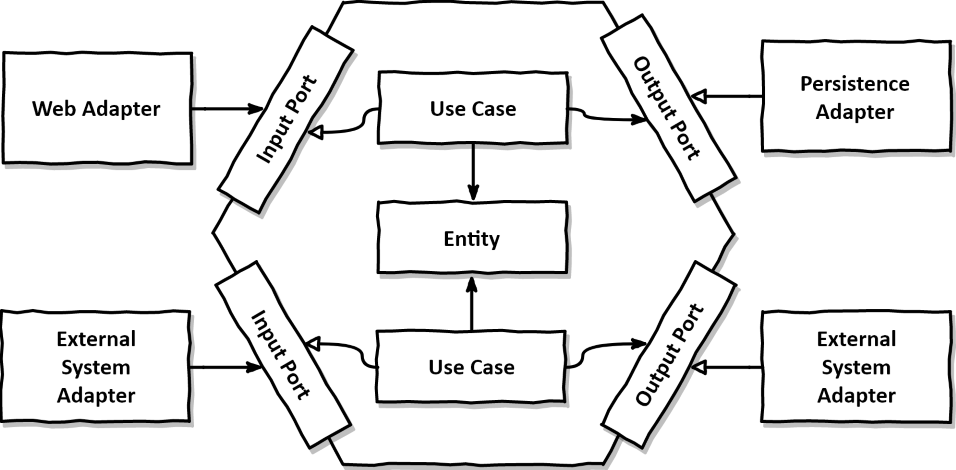

목과 테스트 취약성
=============

의존성을 처리하는 방식에 따라 분파가 갈렸다.
- 고전파 : 단위 테스트를 분리해 병렬로 실행하자. 테스트간의 공유 자원에 대한 문제가 생기는 부분만 대역을 사용하자.
- 런던파 : 불변 의존성을 제외한 모든 의존성을 테스트 대역을 사용해 격리하자

# 1. 목과 스텁 구분 

테스트 대역의 주 용도는 실제 의존성 대신 테스트 대상 시스템을 대신 전달해 테스트를 편리하게 하나, 설정이나 유지보수가 어렵다.

이러한 테스트 대역에는 목과 스텁이 있다.
- 목(= 목, 스파이) : 외부로 나가는 상호 작용을 모방하고 검사. SUT가 상태를 변경하기 위한 의존성을 호출할때 목을 사용. 목은 SUT 관련 의존성 간의 상호 작용을 모방하고 검사한다.
- 스텁(= 스텁, 더미, 페이크): 내부로 들어오는 상호 작용을 모방. SUT가 입력 데이터를 얻기 위한 의존성을 호출할때 사용한다. 스텁은 모방만 한다.

예를 들어 이메일 발송 등 메일 서버에 사이드 이펙트를 초래하는 경우. 외부로 나가는 호출은 목,
데이터 검색등 따로 사이드 이펙트를 일으키지 않는 등 DB에서 데이터를 얻는 동작은 스텁을 사용한다.

*목과 스파이의 차이*는 목은 프레임워크의 도움을 받고, 스파이는 수동으로 직접 작성하는걸 말한다.
*스텁, 더미, 페이크의 차이*는 더미의 경우 null,가짜 문자열등 단순하고 하드코딩 된 값이다. 스텁은 시나리오마다 다른 값을 반환하게끔 구성할 수 있다. 페이크는 스텁과 비슷하나 아직 존재하지 않는 의존성을 대체하고자 구현한다.


## 목

목과 스텁 모두 목 라이브러리를 사용하지만 역할에 따라 목과 스텁이라 구분지어 부른다.


예를 들어 여기서 emailServiceMock는 Mock라이브러리를 썼고, emailServiceMock도 스텁이 아닌 목의 역할을 하지만 이 둘은 구분된다.
아래 예제는 외부로 나가는 상호작용이고, 사이드 이펙트를 일으키는 것뿐이다.
```
@Test
    public void testSendEmail() {
        EmailService emailServiceMock = mock(EmailService.class);

        // 목 객체 설정
        doNothing().when(emailServiceMock).sendEmail(anyString(), anyString());

        // 테스트 실행
        emailServiceMock.sendEmail("test@example.com", "Test Message");

        // 목 객체 검증
        verify(emailServiceMock, times(1)).sendEmail("test@example.com", "Test Message");
    }
```

아래 예제 또한 테스트대역을 Mock 라이브러리를 사용해 활용하지만 스텁이다.
내부로 들어오는 상호 작용, 입력 데이터를 제공하는 호출을 모방한다.
```
@Test
    public void testGetData() {
        DatabaseService databaseServiceStub = mock(DatabaseService.class);

        // 스텁 객체 설정
        when(databaseServiceStub.getData(anyString())).thenReturn("Stub Data");

        // 테스트 실행 = 준비한 응답 설정
        String result = databaseServiceStub.getData("SELECT * FROM table");

        // 결과 검증
        assertEquals("Stub Data", result);
    }
```

## 스텁으로 상호작용 검증X

상호작용을 모방한다는점에서 목과 스텁 동일하지만, 목은 실제로 의존성으로 호출을 하는지까지 검사한다.(외부로 요청이 나가는지를)
그러나 스텁은 내부로 들어오는 상호작용을 모방하지만 실제로 불러와지는지는 검사하지 않는다.

그런데 생각해보면 리팩터링 내성을 향상시키기 위해서는 스텁의 상호작용 검증하지 말아야한다.
세부사항이 아닌 최종 결과를 검증하는것이 리팩터링 내성을 향상시키기 때문이다.

목처럼 우리 프로젝트가 외부로 요청을 제대로 날리는지는 결과적 관점에서 검사해야한다. (이메일이 제대로 날아가는지 검사하는것이 목적이면 결과적으로 이메일을 날리는지는 검사하는 것이 맞다.)
하지만 스텁처럼 지엽적으로 어떤것들이 조회되었는지에 대한 검증은 리팩터링 내성에 적합하지 않다. (왜냐면 보고서 작성에 필요한 특정값을 수집하는 로직이라면 수집이 되는지 까지만 검사하면 되지 그 이상 외부 의존성이 불러와졌는지는 검사하지 않아도 되기 때문이다.)


## 목과 스텁 함께

물론 목과 스텁을 함께 쓰는 경우도 있다. 재고 시스템의 경우가 대표적 예시다.
물건을 구매하려고할때 이러한 요청에 대한 재고가 있는지 검사하는건 스텁이고, 해당 재고가 팔림으로 인해 해당 재고를 삭제하는 로직까지 실행됐는지(삭제로직을 호출했는지) 검사하는건 목이다.
이때는 해당 목 객체가 스텁 역할도 하지만 목인게 더 중요하기때문에 목이라고 한다

## 명령조회분리

목과 스텁의 개념은 명령 조회 분리 원칙(CQS)과 관련이 있다. CQS 원칙에 따르면 모든 메서드는 명령이거나 조회여야한다.
명령은 사이드 이펙트만 초래하고 반환값이 없고, 조회는 사이드 이펙트가 없이 값만 반환한다.

사이드 이펙트를 일으키면 반환값이 없어야하고, 메서드가 값을 반환하면 사이드 이펙트가 없어야 한다.(질문할때마다 답이 달라지면 안된다.)
물론 stack.pop()같이 stack에 대한 값이 사라지는 사이드 이펙트를 초래함과 동시에 pop으로 최상단의 데이터를 조회하는 경우도 있지만 CQS를 되도록이면 지키는 것이 좋다.

그리고 이와 대치 할 수 있는 것이 목이다. 목은 명령이고, 스텁은 조회이다.


# 2. 식별할 수 있는 동작과 구현 세부 사항

목을 사용할때 리팩터링 내성을 신경쓰지 않으면 테스트 취약성이 발생한다.
엔드 투 엔드 테스트가 아닌 단위테스트라면 리팩터링 내성을 최대한 활용하는 것이 좋다.  
거짓 양성(기능은 성공이지만 테스트는 실패)의 발생 원인은 테스트가 구현 세부 사항과 강결합이 되어있기 때문이었다. 이를 피하기 위해서는 테스트는 '어떻게'가 아닌 '무엇'애 중점을 둬야한다. 


### 그래서 구현 세부 사항은 뭐고, 식별할 수 있는 동작은 뭘까?

식별할 수 있는 동작은 공개 API와 다르다.
모든 제품 코드는 2차원으로 분류할 수 있다.

- **공개 API / 비공개 API**
  - 이는 해당 API가 비공개 멤버(private)라서 외부에서 조회를 할 수 있는지 없는지에 대한 이야기이다. 클래스 내의 비공개 API가 예시다.

- **식별할 수 있는 동작 / 내부 구현 세부 사항**
  - 식별할 수 있는 동작 : 식별할 수 있는 동작은 사용자가 API를 통해 직접 상호작용하는 동작을 말함
    1. 클라이언트가 목표를 달성하는데 도움이 되는 연산을 노출하는 것. 계산을 수행하거나 사이드 이펙트를 초래하거나
    2. 목표를 달성하는데 도움이 되는 상태를 노출하는 것. 상태는 시스템의 현재 상태를 말한다.

  - 내부 구현 세부 사항 : 구현 세부사항은 내부적으로 어떻게 동작이 수행되는지에 대한 것
    1. 클래스 내부의 로직, 데이터베이스 접근, 네트워크 호출, 알고리즘 등 구체적인 구현 방법등을 말함

이러한 구분에 따르면 시스템의 공개 API는 식별할 수 있는 동작이어야하며 비공개 API는 구현 세부 사항이어야한다. 

구체적인 예시를 들자면 사용자가 호출하는 컨트롤러의 경우 공개 API며 식별할 수 있는 동작이며, DB와의 연결을 확인하고 데이터를 조회하는 인터페이스의 경우 비공개 API인 셈이다.


### 잘못 설계

공개 API는 식별할 수 있는 동작이어야한다고 했는데, 구현 세부 사항이 API가 되는 경우도 있다. **아래는 구현 세부 사항중 연산을 노출한 예시이다.**


```
// User클래스
public class User {
    public String name;

    public User(String name) {
        this.name = name;
    }

    // 내부 데이터를 직접 반환
    public String getName() {
        return name;
    }

    // 내부 데이터를 직접 설정
    public void setName(String name) {
        this.name = name;
    }

    public void nornalizeName(String name) {
        if (name != null && !name.trim().isEmpty()) {
            this.name = name;
        }
    }
}

// 이를 활용하는 컨트롤러 로직

...
User user = new User();
string normalizedName = user.nornalizeName(newName);
user.setName(normalizedName);
...

```

User클래스의 name을 바꾸는 예제다. 속성과 메서드가 둘다 공개이다. 클래스 API를 잘 설계하려면 해당 멤버가 식별할 수 있는 동작이 되도록 해야한다.

- 클라이언트가 목표를 달성하는 데 도움이 되는 작업/상태만을 노출해야한다.

라는 원칙을 떠올려보자.

이 경우 name의 속성이 public인 부분만 이 요구사항을 충족한다. nornalizeName메서드도 작업이지만 *사용자 이름 변경* 이라는 동작에서 목표와는 직결되지 않으니 클라이언트에게 노출할 필요는 없다.

이 상황에서 User 클래스의 nornalizeName메서드를 숨기고 setter에서 호출하는 방식으로 바꾸는식으로 설계를 고도화할 수 있다.

아래와 같이 바꾸면 식별할 수 있는 동작(setter)만 공개돼있고 구현세부사항은 비공개API뒤에 숨겨져 있다.
```
// User클래스
public class User {
    private String name;

    public User(String name) {
        this.name = name;
    }

    // 내부 데이터를 직접 반환
    public String getName() {
        return name;
    }

    // 내부 데이터를 직접 설정
    public void setName(String name) {
        this.name = nornalizeName(name);
    }

    public void nornalizeName(String name) {
        if (name != null && !name.trim().isEmpty()) {
            this.name = name;
        }
    }
}

// 이를 활용하는 컨트롤러 로직

...
User user = new User();
user.setName(newName);
...

```

*그러면 클래스가 이런식으로 구현 세부 사항을 유출하고 있는지 아닌지 판단하기 위한 규칙이 있을까?* -> 이상적으로는 단일 연산으로 개별 목표를 달성해야 한다.


## 잘 설계된 API

유지보수 하기 좋은 API는 보통 캡슐화를 잘 지킨다.
캡슐화란 불변성 위반, 항상 참이어야하는 조건이다. 간단히 설명하자면 User에서 name에 대한 기준이 50자를 초과하면 안된다고 정했으면 항상 50자가 넘지 않는것이 예시다.(불변성)

그렇다면 구현 세부 사항을 노출하면 이러한 불변성을 지키기가 힘들어진다. 예를 들어 setter를 통해 이름을 할당하지 않는다면 정규화하지 않고 새 이름을 public한 name에 바로 할당할 수 있다.

불변성은 유지보수에서 더더욱 중요하진다. 코드가 복잡해지면 어떤것이 상태를 변환해도 되는 것이고 아닌지를 구분하지 못한다. 코드 API가 해당 코드로 할 수 있는것과 할수 없는것이 뭔지 캡슐화해놓지 않는다면 코드가 변경됐을때 여러 모순이 생길 수 있다. (히스토리를 모르는 담당자가 한번 할당되고나서 바뀌면 안되는 값에 대해 바꾸는 로직을 작성한다면?)

이러한 상황을 방지하기 위해 잘못할 수 있는 옵션조차 제공치 않도록 해야한다. 제품 코드의 캡슐화는 궁극적으로 단위 테스트와 동일한 목표를 가진다.(지속가능성)

*묻지 말고 말하라*

- 구현 세부 사항을 숨기면 클래스 내부를 가릴 수 있기 때문에 내부를 손상시킬 위험이 적다.
- 데이터와 연산을 결합하면 해당 연산이 클래스의 불변성을 위반하지 않도록 예방할 수 있다.


## 구현 세부 사항 유출

연산이 노출된 경우는 보았으니 상태의 예시를 들겠다.

내부 상태인 roles이 외부에 유출되지 않고 내용이 변하지 않도록 상태에 대한 노출을 비공개 API로 작성한 예제다.

```
public class User {
    private List<String> roles;

    public User() {
        this.roles = new ArrayList<>();
    }

    public void addRole(String role) {
        if (role != null && !role.trim().isEmpty()) {
            roles.add(role);
        } else {
            throw new IllegalArgumentException("Role cannot be null or empty");
        }
    }

    public List<String> getRoles() {
        return Collections.unmodifiableList(roles);
    }

    public boolean hasRole(String role) {
        return roles.contains(role);
    }
}
```

위와같이 캡슐화를 지키고, 구현 세부 사항을 비공개로 둔다면 테스트코드 또한 자연스럽게 리팩터링 내성을 지킬 수 있다.

테스트 코드에서 role리스트에 직접적인 접근을 한다면 추후 리팩터링에서 문제가 될 수있으나 내부상태를 적절히 캡슐화 했기 때문에 클래스의 내부 구현이 변경되더라도, 공개된 인터페이스가 동일하게 유지되는 한 테스트 코드는 여전히 유효하다.

```
public class UserTest {

    @Test
    public void testAddRole() {
        User user = new User();
        user.addRole("Admin");

        assertTrue(user.hasRole("Admin"));
    }

    @Test(expected = IllegalArgumentException.class)
    public void testAddRoleWithInvalidRole() {
        User user = new User();
        user.addRole(null); // 예외가 발생해야 함
    }

    @Test
    public void testGetRoles() {
        User user = new User();
        user.addRole("Admin");
        user.addRole("User");

        List<String> roles = user.getRoles();
        assertEquals(2, roles.size());
        assertTrue(roles.contains("Admin"));
        assertTrue(roles.contains("User"));
    }
}

```

정리하자면 모든 구현 세부 사항을 비공개로 하고 테스트가 식별할 수 있는 동작을 검증하면 리팩터링 내성이 좋아진다.

- 연산과 상태를 최소한으로 노출하고
- 클라이언트가 목표를 달성하는 데 직접적으로 도움이 되는 코드만 공개하고, 구현 세부 사항은 비공개 API 뒤로 숨겨야 한다.


# 3. 목과 테스트 취약성 간의 관계

## 육각형 아키텍처


(참조 : https://tech.osci.kr/hexagonal-architecture/)

전형적인 애플리케이션은 애플리케이션 서비스 레이어와 도메인(비즈니스 로직)레이어로 나뉜다.

애플리케이션 서비스 계층은 도메인 계층 위에 있으며 외부 환경과의 통신을 조정한다. 예시로는 데이터베이스를 조회하거나, 연산이 필요하면 도메인으로 호출하거나, DB에 저장한다. 요약하자면 다른 애플리케이션과의 소통과 도메인 로직의 호출을 담당한다.

육각형 아키텍처 또한 지켜야하는 지침이 세가지 있다.

**1. 도메인 계층과 애플리케이션 서비스 계층 간의 관심사 분리**
   - 도메인 계층은 비즈니스 로직에 대해서만 책임을 져야한다. 외부 애플리케이션과 통신해야하는 책임은 애플리케이션 서비스에서 해야한다. 반대로 애플리케이션 서비스 단에서는 어떤 비즈니스 로직도 있으면 안된다. 요청이 들어 올 시 클래스의 연산으로 변환한 다음 결과를 저장하거나 호출자에게 다시 반환해서 도메인 계층으로 변환해야하는 책임이 있다.
   - 정리하자면 애플리케이션 서비스 계층은 비즈니스 유스케이스(사용 대상)이며, 도메인 계층은 도메인 지식(사용 방법)의 모음이다.

**2. 애플리케이션 내부 통신**
   - 육각형 아키텍처는 애플리케이션 서비스 계층에서 도메인 계층으로 흐르는 단방향 의존해야한다.
   - 도메인 계층 내부 클래스는 내부 클래스끼리 서로 의존하고 서비스 계층의 클래스에 의존하지 않는다.
   - 이러한 지침에 따르면 애플리케이션 서비스 계층은 도메인 계층에 대해 알지만 반대는 아니다. (의존성 역전 원칙을 지키는 것)

**3. 애플리케이션 간의 통신**
   - 외부 애플리케이션은 애플리케이션 서비스 계층에 있는 공통 인터페이스를 통해 해당 애플리케이션에 연결된다.(도메인 계층에 직접 접근X)


애플리케이션의 각 계층은 식별할 수 있는 동작을 나타낸다. 이러한 동작들은 도메인 로직에서 구현 세부 사항을 포함하고 있다.
잘 설계된 API원칙에는 프랙탈 특성이 있다. 

각 계층의 API를 잘 설계하면(구현 세부 사항을 숨기면) 테스트도 프랙탈 구조를 갖기 시작한다.

프랙탈 구조를 갖는다는게 무슨 얘기냐면
애플리케이션 서비스 테스트 = 비즈니스 유스케이스를 검사
도메인 클래스 테스트 = 유스케이스 완료 방법에 대한 중간의 하위 목표를 검증

테스트가 전체 시스템의 테스트와 유사한 구조를 갖는다는 것을 의미한다. 작은 부분을 테스트하는 방식이 전체 시스템을 테스트하는 방식과 유사하게 조직되는걸 말한다.

예시를 들자면

```
// 단위테스트

@Test
    public void testAddItem() {
        Order order = new Order();
        order.addItem(new OrderItem("item1", 2, 100.0));
        assertEquals(1, order.getItems().size());
    }

// 통합테스트

@Test
    public void testValidateAndSaveOrder() {
        OrderRepository mockRepository = mock(OrderRepository.class);
        OrderService orderService = new OrderService(mockRepository);
        Order order = new Order();
        order.addItem(new OrderItem("item1", 2, 100.0));

        orderService.validateAndSaveOrder(order);

        verify(mockRepository, times(1)).save(order);
    }

// 시스템테스트

@Test
    public void testCreateOrder() {
        OrderRepository orderRepository = new InMemoryOrderRepository();
        OrderService orderService = new OrderService(orderRepository);
        OrderApplicationService applicationService = new OrderApplicationService(orderRepository, orderService);

        Order order = new Order();
        order.addItem(new OrderItem("item1", 2, 100.0));
        applicationService.createOrder(order);

        assertTrue(orderRepository.findAll().contains(order));
    }
```

어떤 테스트든 비즈니스 요구사항으로 거슬러 올라 갈 수 있어야한다.
외부 클라이언트에게 중요한 목표는 개별 도메인 클래스에서 달성한 하위 목표로 변환된다. 따라서 도메인 계층에서 보여지는 식별할 수 있는 동작(공개API)들은 각각의 구체적인 비즈니스 유스케이스와 연관성이 있다.

무슨말인지 알겠어~! 결국 우리가 테스트하는건 식별할 수 있는 동작(공개API)이고 구현 세부 사항(비공개 API)에 대한건 식별할 수 있는 동작에 대한 테스트는 결국 시스템테스트에서 검사하고자하는 것과 똑같다는거잖아~ 

이걸 전문적으로 말하자면 *코드베이스의 공개API를 항상 비즈니스 요구사항에 따라 추적하라*

## 시스템 내부 통신과 시스템 간 통신

