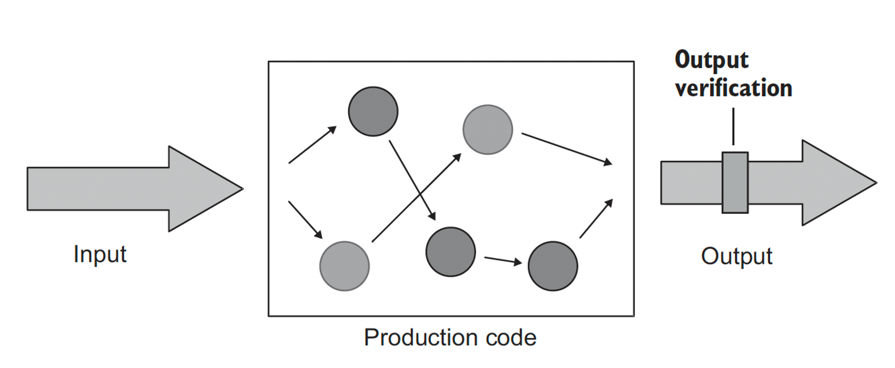
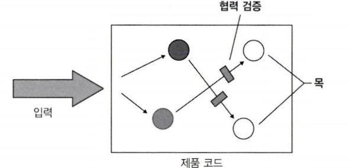

단위 테스트 스타일
=============

단위 테스트 스타일
- 출력 기반 -> 가장 추천, 그러나 순수 함수 방식으로 작성된 코드에만 적용 가능
- 상태 기반 -> 얘도 괜찮은 선택
- 통신 기반 -> 간헐적으로 추천

출력 기반의 단위 테스트 스타일을 적용하려면 기반 코드를 함수형 아키텍처를 지향하게끔 재구성해야 한다.
함수형 프로그래밍과 함수형 아키텍처가 지닌 한계도 알아보자!

# 1. 단위 테스트의 세가지 스타일

단위 테스트에는 세가지 스타일이 있다. 하나의 테스트에서 여러가지 스타일을 섞어서 사용할 수 있다.

## 출력 기반 스타일

\

출력 기반 테스트란
- 테스트 대상 시스템에 입력을 넣고 생성되는 출력을 점검하는 방식
- 전역 상태나 내부 상태를 변경하지 않는 코드에만 적용되므로 *반환값만 검증*한다.
- 이러한 테스트 스타일은 사이드 이펙트가 없고 SUT 작업 결과는 호출자에게 반환하는 값 뿐이다.


```
public class PriceEngine {
    public double calculateDiscount(Product... products) {
        double discount = products.length * 0.01;
        return Math.min(discount, 0.2);
    }
}


public class Product {
    private String name;

    public Product(String name) {
        this.name = name;
    }

    public String getName() {
        return name;
    }
}

// test
@Test
    public void discountOfTwoProducts() {
        Product product1 = new Product("Hand wash");
        Product product2 = new Product("Shampoo");
        PriceEngine sut = new PriceEngine();

        double discount = sut.calculateDiscount(product1, product2);

        assertEquals(0.02, discount);
    }
```

PriceEngine은 상품 수에 1%를 곱하고 그 결과를 20%로 제한한다. 이 클래스는 이 동작만 수행하며 내부 컬렉션에 상품을 추가하거나 데이터베이스에 저장하지 않는다. 메서드의 결과는 반환된 할인, 출력값뿐이다.

이러한 출력 기반 단위 테스트 스타일을 함수형이라고도 한다.
함수형 프로그래밍이란 사이드 이펙트 없는 코드 선호를 강조하는 방식을 말한다.

## 상태 기반 스타일


상태 기반 스타일은 
- 작업이 완료된 후 시스템 상태를 확인한다.
- 데이터베이스나 파일 시스템등과 괕은 프로세스 외부 의존성의 상태를 확인한다.(최종 상태 검증)

```
public class Order {
    private final List<Product> products = new ArrayList<>();

    public List<Product> getProducts() {
        return Collections.unmodifiableList(products);
    }

    public void addProduct(Product product) {
        products.add(product);
    }
}

// 테스트

@Test
    public void addingAProductToAnOrder() {
        Product product = new Product("Hand wash");
        Order sut = new Order();

        sut.addProduct(product);

        assertEquals(1, sut.getProducts().size());
        assertEquals(product, sut.getProducts().get(0));
    }
```

상태 기반의 테스트는 상품을 추가한 후 Product의 상태를 검증한다. addProduct의 결과는 *주문 상태의 변경*이기 때문이다.

## 통신 기반 스타일



통신 기반 스타일은
- 목을 사용해 테스트 대상 시스템과 협력자 간의 통신을 검증한다.

```
@Test
    public void sendingAGreetingsEmail() {
        IEmailGateway emailGatewayMock = mock(IEmailGateway.class);
        Controller sut = new Controller(emailGatewayMock);

        sut.greetUser("user@email.com");

        verify(emailGatewayMock, times(1)).sendGreetingsEmail("user@email.com");
    }
```

통신 기반 테스트는 SUT의 협력자를 목으로 대체하고 SUT가 협력자를 올바르게 호출하는지 검증한다.

+) 단위 테스트의 고전파는 통신 기반 스타일보다 상태 기반 스타일을 선호한다. 런던파는 통신 기반 스타일을 선호한다.

# 2. 단위 테스트 스타일 비교

단위테스트 스타일을 좋은 단위 테스트의 4대 요소와 함께 살펴보자. (리마인드)


- 회귀 방지: 기존 기능이 새로운 코드 변경으로 깨지지 않도록 보장함.
- 리팩터링 내성: 코드 구조 바꿔도 기능이 동일하게 동작하는지 확인함.
- 빠른 피드백: 코드 변경 후 바로 테스트 결과 제공해 문제 빨리 발견함.
- 유지 보수성: 코드 변경 시 테스트로 기능 제대로 작동하는지 확인해 유지보수 쉽게 함.

## 회귀방지 & 피드백 속도 지표로 스타일 비교

회귀 방지 지표는 특정 스타일에 따라 달라지지 않는다. 회귀 방지 지표는 세가지 특성으로 결정된다.
- 테스트 중에 실행되는 코드의 양 -> 어떤 스타일도 이 부분에선 도움X
- 코드 복잡도 -> 얘네들도 마찬가지
- 도메인 유의성

테스트가 프로세스 외부 의존성과 떨어져 단위 테스트 영역에 있는 한, 테스트 스타일과 테스트 피드백 속도 사이에는 상관관계가 거의 없다.

## 리팩터링 내성 지표로 스타일 비교

리팩터링 내성은 리팩터링 중에 발생하는 거짓 양성수에 대한 척도다. 코드의 구현 세부 사항에 테스트가 결합되어 있을때 나타난다.

- **출력 기반 테스트**는 테스트 대상 메서드에만 결합되므로 거짓 양성 방지가 우수하다. -> 다만 테스트가 특정 구현 방법에 너무 의존해서, 구현 방법이 바뀌면 테스트도 실패하는 경우도 있다. (잘못된 방법)
- **상태 기반 테스트**는 거짓 양성이 되기 