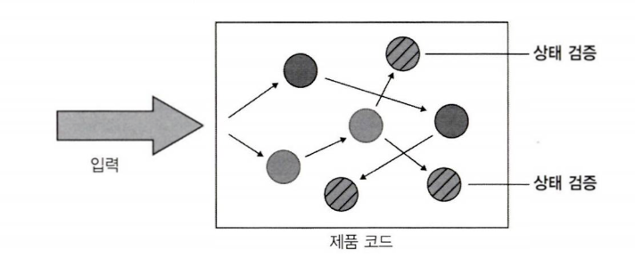
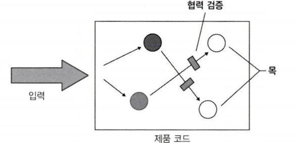
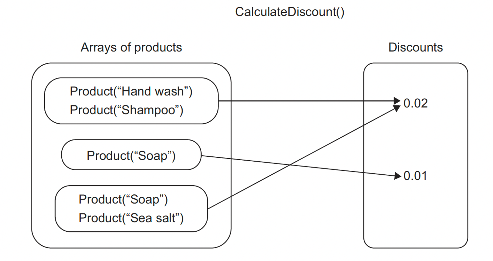
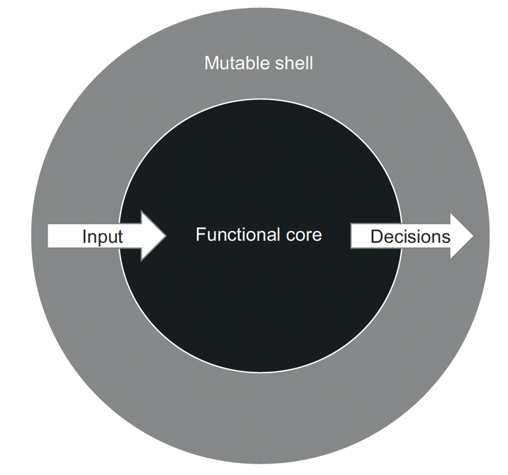
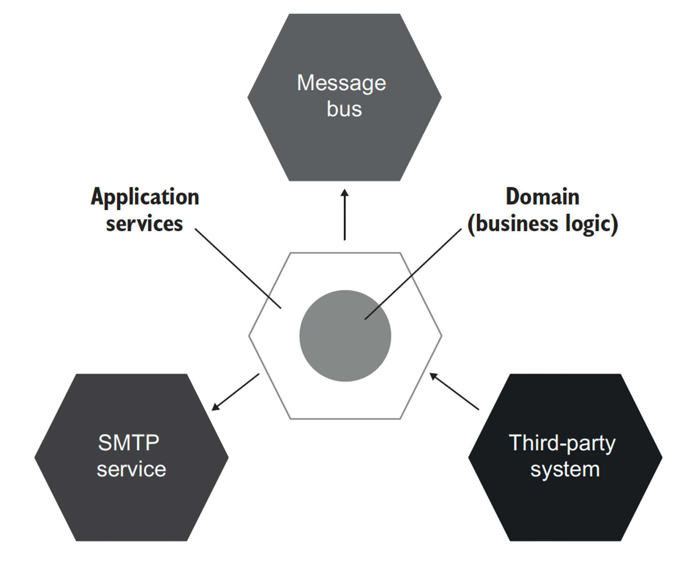
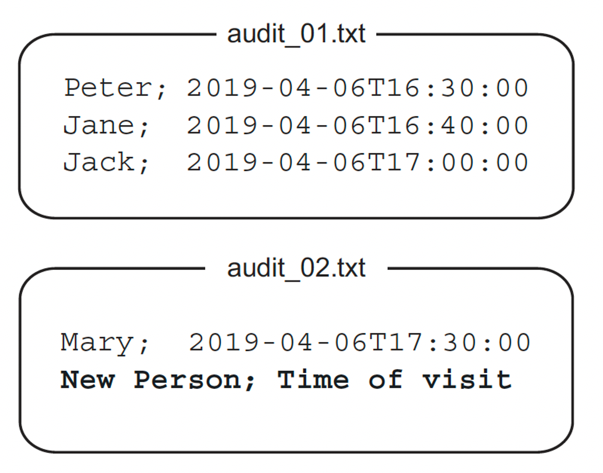
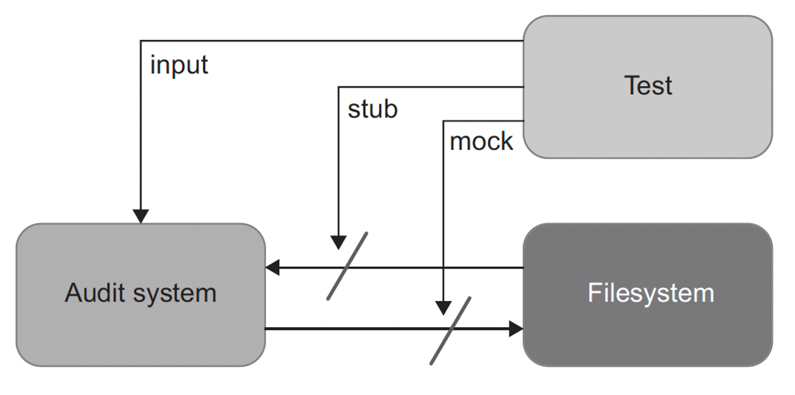
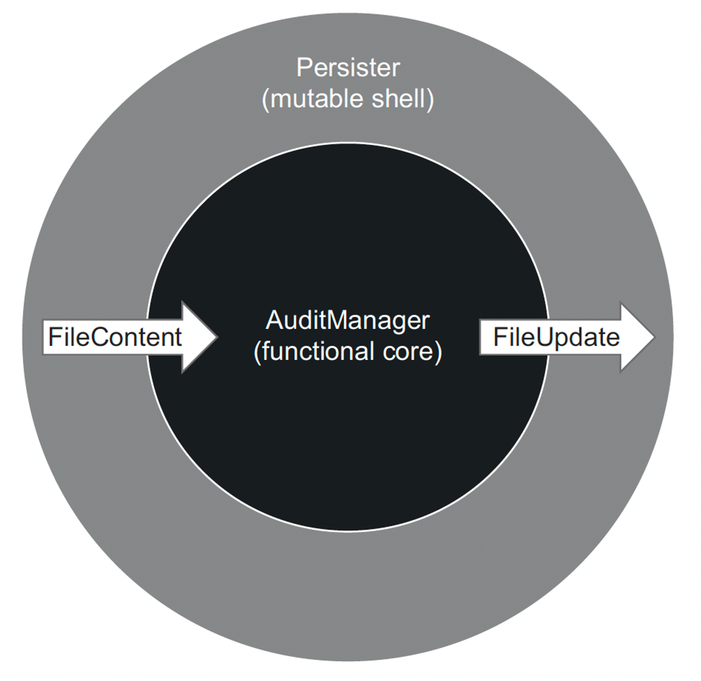
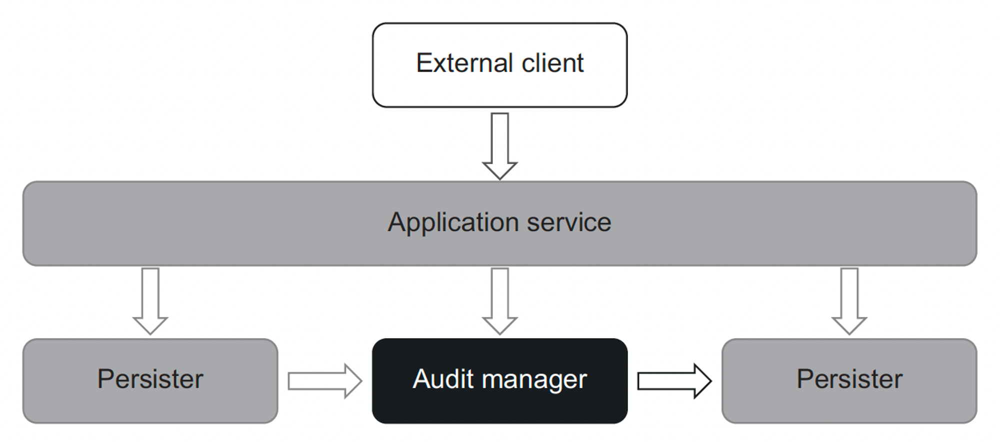

단위 테스트 스타일
=============

단위 테스트 스타일
- 출력 기반 -> 가장 추천, 그러나 순수 함수 방식으로 작성된 코드에만 적용 가능
- 상태 기반 -> 얘도 괜찮은 선택
- 통신 기반 -> 간헐적으로 추천

출력 기반의 단위 테스트 스타일을 적용하려면 기반 코드를 함수형 아키텍처를 지향하게끔 재구성해야 한다.
함수형 프로그래밍과 함수형 아키텍처가 지닌 한계도 알아보자!

# 1. 단위 테스트의 세가지 스타일

단위 테스트에는 세가지 스타일이 있다. 하나의 테스트에서 여러가지 스타일을 섞어서 사용할 수 있다.

## 출력 기반 스타일


출력 기반 테스트란
- 테스트 대상 시스템에 입력을 넣고 생성되는 출력을 점검하는 방식
- 전역 상태나 내부 상태를 변경하지 않는 코드에만 적용되므로 *반환값만 검증*한다.
- 이러한 테스트 스타일은 사이드 이펙트가 없고 SUT 작업 결과는 호출자에게 반환하는 값 뿐이다.


```
public class PriceEngine {
    public double calculateDiscount(Product... products) {
        double discount = products.length * 0.01;
        return Math.min(discount, 0.2);
    }
}


public class Product {
    private String name;

    public Product(String name) {
        this.name = name;
    }

    public String getName() {
        return name;
    }
}

// test
@Test
    public void discountOfTwoProducts() {
        Product product1 = new Product("Hand wash");
        Product product2 = new Product("Shampoo");
        PriceEngine sut = new PriceEngine();

        double discount = sut.calculateDiscount(product1, product2);

        assertEquals(0.02, discount);
    }
```

PriceEngine은 상품 수에 1%를 곱하고 그 결과를 20%로 제한한다. 이 클래스는 이 동작만 수행하며 내부 컬렉션에 상품을 추가하거나 데이터베이스에 저장하지 않는다. 메서드의 결과는 반환된 할인, 출력값뿐이다.

이러한 출력 기반 단위 테스트 스타일을 함수형이라고도 한다.
함수형 프로그래밍이란 사이드 이펙트 없는 코드 선호를 강조하는 방식을 말한다.

## 상태 기반 스타일



상태 기반 스타일은 
- 작업이 완료된 후 시스템 상태를 확인한다.
- 데이터베이스나 파일 시스템등과 괕은 프로세스 외부 의존성의 상태를 확인한다.(최종 상태 검증)

```
public class Order {
    private final List<Product> products = new ArrayList<>();

    public List<Product> getProducts() {
        return Collections.unmodifiableList(products);
    }

    public void addProduct(Product product) {
        products.add(product);
    }
}

// 테스트

@Test
    public void addingAProductToAnOrder() {
        Product product = new Product("Hand wash");
        Order sut = new Order();

        sut.addProduct(product);

        assertEquals(1, sut.getProducts().size());
        assertEquals(product, sut.getProducts().get(0));
    }
```

상태 기반의 테스트는 상품을 추가한 후 Product의 상태를 검증한다. addProduct의 결과는 *주문 상태의 변경*이기 때문이다.

## 통신 기반 스타일



통신 기반 스타일은
- 목을 사용해 테스트 대상 시스템과 협력자 간의 통신을 검증한다.

```
@Test
    public void sendingAGreetingsEmail() {
        IEmailGateway emailGatewayMock = mock(IEmailGateway.class);
        Controller sut = new Controller(emailGatewayMock);

        sut.greetUser("user@email.com");

        verify(emailGatewayMock, times(1)).sendGreetingsEmail("user@email.com");
    }
```

통신 기반 테스트는 SUT의 협력자를 목으로 대체하고 SUT가 협력자를 올바르게 호출하는지 검증한다.

+) 단위 테스트의 고전파는 통신 기반 스타일보다 상태 기반 스타일을 선호한다. 런던파는 통신 기반 스타일을 선호한다.

# 2. 단위 테스트 스타일 비교

단위테스트 스타일을 좋은 단위 테스트의 4대 요소와 함께 살펴보자. (리마인드)


- 회귀 방지: 기존 기능이 새로운 코드 변경으로 깨지지 않도록 보장함.
- 리팩터링 내성: 코드 구조 바꿔도 기능이 동일하게 동작하는지 확인함.
- 빠른 피드백: 코드 변경 후 바로 테스트 결과 제공해 문제 빨리 발견함.
- 유지 보수성: 코드 변경 시 테스트로 기능 제대로 작동하는지 확인해 유지보수 쉽게 함.

## 회귀방지 & 피드백 속도 지표로 스타일 비교

회귀 방지 지표는 특정 스타일에 따라 달라지지 않는다. 회귀 방지 지표는 세가지 특성으로 결정된다.
- 테스트 중에 실행되는 코드의 양 -> 어떤 스타일도 이 부분에선 도움X
- 코드 복잡도 -> 얘네들도 마찬가지
- 도메인 유의성

테스트가 프로세스 외부 의존성과 떨어져 단위 테스트 영역에 있는 한, 테스트 스타일과 테스트 피드백 속도 사이에는 상관관계가 거의 없다.

## 리팩터링 내성 지표로 스타일 비교

리팩터링 내성은 리팩터링 중에 발생하는 거짓 양성수에 대한 척도다. 코드의 구현 세부 사항에 테스트가 결합되어 있을때 나타난다.

- **출력 기반 테스트**는 테스트 대상 메서드에만 결합되므로 거짓 양성 방지가 우수하다. -> 다만 테스트가 특정 구현 방법에 너무 의존해서, 구현 방법이 바뀌면 테스트도 실패하는 경우도 있다. (잘못된 방법)
- **상태 기반 테스트**는 거짓 양성이 되기 쉽다. 테스트 대상 메서드 외에도 클래스 상태와 함께 작동한다. 상태 기반 테스트는 큰 API 노출 영역에 의존하므로, 구현 세부 사항과 결합할 가능성이 높다.
- **통신 기반 테스트**는 허위 경보에 가장 취약하다. 테스트 대역으로 상호작용을 하는 테스트는 대부분 깨지기 쉽다.(스텁이야기) 스텁을 이용해 상호작용을 확인하면 안된다. 여기서 상호작용을 확인하면 안된다는 말은, 단순히 내부 메서드 호출이나 객체 간의 상호작용을 확인하는 것이 아닌, 애플리케이션 경계를 넘는 실제 통신을 테스트해야 한다는 의미임. 내부 구현 디테일에 의존하지 않고, 전체적인 통신 결과를 테스트해야 한다는 의미이다.

요약하자면 상태 기반 테스트는 객체의 상태 변화를 검증하는 데 유용하지만, 내부 상태나 구현 세부 사항과의 결합을 최소화하여 유지보수성을 높이는 것이 중요하고, 통신기반 테스트는 단순히 내부 메서드 호출이나 객체 간의 상호작용을 확인하는 것이 아니라, 시스템 간의 실제 통신과 그 결과를 테스트해야 하도록 해야한다.

## 유지 보수성 지표로 스타일 비교

요지 보수성은 단위 테스트의 유지비를 측정하며 두가지 특성으로 정의한다.

- 테스트가 얼마나 이해하기 어려운지(테스트 크기에 대한 함수) -> 테스트가 크면 필요할때 파악 or 변경이 어렵기 때문이다
- 테스트를 얼마나 실행하기 어려운지(테스트에 직접적으로 관련있는 프로세스 외부 의존성 개수에 대한 함수가 얼마나있는지) -> 하나 이상의 프로세스 외부 의존성과 연결되어있다면 운영에 시간이 필요하므로 유지보수 어려움

다른 두가지 스타일과 비교할때 **출력 기반 테스트**가 가장 유지 보수하기 용이하다.
1. 입력과 출력을 검증만 하기 때문에 간단하고
2. 출력 기반은 전역 상태나 내부 상태를 변경하지 않으므로 외부 의존성을 다루지 않기 때문이다.

**상태 기반 테스트**는 유지보수가 상대적으로 어렵다.
1. 출력 검증보다 종종 더 많은 공간을 차지 하기 때문이다. 

예를 들어 단순히 댓글 추가 후 댓글 목록에 댓글이 나타났는지 확인하는 예제는 코드 크기가 대폭 커지기도 한다. 이를 도와주는 *헬퍼 메서드*가 있다. 또한 *값 객체로 클래스 변환*하기도 있다.

그러나 이런식으로 값 객체를 생성하는 것은 본질적으로 클래스가 값에 해당하고 값 객체로 변환할 수 있을때만 효과적이고, 아니라면 코드 오염이다.

**통신 기반 테스트**는 유지보수성 최약체다(ㅋㅋ)
통신 기반 테스트에는 테스트 대역과 상호 작용 검증을 설정해야하는데 여기서 공간을 많이 차지한다. 또한 목이 사슬 형태(목이 다른 목을 반환.. 또 다른목을 반환..)로 있는 경우가 존재하기에 테스트가 커지고 유지보수가 어려워진다.


## 결론

	
| | 출력 기반 | 상태 기반 | 통신 기반|
|------|---|---|---|
| 리팩터링 내성을 지키기 위해 필요한 노력 | 낮음 | 중간 | 중간 |
| 유지비 | 낮음 | 중간 | 높음

스타일을 비교해보자. 세 가지 스타일 모두가 회귀 방지와 피드백 속도 지표에서는 점수가 같다.

그걸 제외하고 보자면 출력 기반 테스트가 가장 결과가 좋다. 구현 세부 사항과 결합되지 않아 리팩터링 내성에 크게 신경 쓰지 않아도 되고, 간결하고 프로세스 외부 의존성이 없기 때문에 유지 보수도 용이하다.

상태 & 통신 기반 테스트는 유출되는 구현 세부 사항에 결합할 가능성이 높고, 크기도 커서 유지비가 많이 들기 때문에 지표가 좋지 않다.

그렇다면 출력 기반 테스트만.. 하면 되는 것 아닌가? 그렇지도 않다. 출력 기반은 *함수형으로 작성된 코드에만 적용이 가능*하고 대부분의 객체지향 프로그래밍 언어에는 해당하지 않는다. 그래도 출력 기반 스타일로 변경할수는 있다!

# 3. 함수형 아키텍처 이해

## 그래서 함수형 프로그래밍이 뭔데?

출력 기반 단위 테스트 스타일을 함수형이라고도 한다. 기반 제품 코드를 함수형 프로그래밍을 이용해 순수 함수 방식으로 작성해야 하기 때문이다.

함수형 프로그래밍은 수학적 함수를 사용한 프로그래밍이다.
1. 수학적 함수는 숨은 입출력이 없는것을 말한다. 
2. 수학적 함수의 모든 입출력은 메서드 이름,인수,반환 타입으로 구성된 메서드 시그니처에 명시해야한다.
3. 수학적 함수는 호출 횟수에 상관 없이 주어진 입력에 대해 동일한 출력을 생성한다.  
  


```
public int add(int a, int b) {
    return a + b;
}
```

정말 단순한 예시로 덧셈 기능을 가진 add 메서드는 함수형이다. add(2, 3)을 호출할 때마다 결과는 항상 5이기 때문이다.

또한

```
public decimal CalculateDiscount(Product[] products) {
    decimal discount = products.Length * 0.01m;
    return Math.Min(discount, 0.2m);
}
```

이전에 나온 예시인 할인율을 계산하는 것도 함수형이다.

출력 + 이름 + 입력 -> 메서드 시그니처  
decimal + CalculateDiscount + (Product[] products)

의 형태를 가지고있기에 수학적 함수가 된다.



함수 f(x) = x+1과 동일한 표기법으로 표현한 CalculateDiscount()메서드이다. 상품의 각 입력 배열에 대해 해당 할인을 출력으로 찾는다.


입출력을 명시한 수학적 함수의 이점
- 테스트가 짧고 간결하며 이해하기 쉽고 유지보수 하기 쉬우므로 테스트가 쉽다.
- 출력 기반 테스트를 적용할 수 있는 것은 수학적 함수 뿐이다. 즉, 유지보수성이 뛰어나고 거짓 양성 빈도가 낮다.

숨은 입출력의 유형은 아래와 같다.
- 사이드 이펙트 :  메서드 시그니처에 표시되지 않은 출력, 즉 숨어있다. 연산은 클래스 인스턴스의 상태를 변경하고 파일을 업데이트 하는 등 부작용을 야기한다.
- 예외 : 호출된 예외는 호출 스택의 어느 곳에서도 발생할 수 있으므로, 메서드 시그니처가 전달하지 않는 출력을 추가한다.
- 내외부 상태에 대한 참조 : LocalDate.now() 와 같이 정적 속성을 사용해 값을 가져오는 메서드가 있다. DB에서 데이터를 질의하거나 비공개 변경 가능 필드를 참조할 수도 있다. 즉, 모두 메서드 시그니처에 없는 실행에 대한 입력이며, 숨어있다.

메서드가 수학적 함수인지 판별하는 방법은
1. 동작을 변경하지 않고
2. 해당 메서드에 대한 호출을 반환 값으로 대체할 수 있는지 확인하는 것이다 &rarr; 이를 참조 투명성이라고 한다.

예를 들어
```
// 이거는 수학적 함수지만
public int add1(int a) {
    return a + 1;
}

// 이건 수학적 함수가 아니다.
public int add2(int a) {
    a++;
    return a;
}
```

add1은 저 자리에 a=1일때 return 2로 대체될 수 있지만 add2는 대체되지 못하므로 *참조투명성*이 없는셈이다.

즉, 숨은 출력은 전역 필드 x의 변경(side effect)이다.

## 함수형 아키텍처란?

당연히 어떤 사이드 이펙트도 일으키지 않는 애플리케이션을 만들 순 없다. 사이드 이펙트는 사용자 정보 업데이트, 물품 구매, 판매 등 모든 애플리케이션에서 발생한다.

*함수형 프로그래밍의 목표는 사이드 이펙트를 완전히 없애는 것이 아닌, 비즈니스 로직을 처리하는 코드와 사이드 이펙트을 일으키는 코드를 분리하는 것이다*. 

사이드 이펙트를 비즈니스 연산 끝으로 몰아서 비즈니스 로직을 사이드 이펙트와 분리하자.

두가지 유형을 구분해 비즈니스 로직과 사이드 이펙트를 분리할 수 있다.

- 결정을 내리는 코드(함수형 코어 or 불변 코어) : 이 코드는 사이드 이펙트가 필요 없기 때문에 수학적 함수를 사용해 작성할 수 있다.
- 해당 결정에 따라 작용하는 코드(가변 셸) : 이 코드는 수학적 함수에 의해 이뤄진 모든 결정을 DB의 변경이나 메시지 버스로 전송된 메시지와 같이 가시적인 부분으로 변환한다.



함수형 아키텍처에서 함수형 코어는 애플리케이션에서 모든 결정을 내리고, 가변셀은 함수형 코어에 입력형 데이터 제공 or 외부 의존성에 사이드 이펙트를 적용해 결정을 해석한다.

함수형 코어와 가변 셸의 협력 방식이다.

- 가변 셸은 모든 입력 수집 -> 함수형 코어가 결정 생성 -> 셸은 결정을 사이드 이펙트로 변환

이 두 계층을 잘 분리하면 가변 셸이 의사 결정을 추가하지 않게끔 클래스에 정보가 충분히 있는지 확인해야 한다. *함수형 아키텍처의 목표는 출력 기반 테스트를 함수형 코어를 다루고, 가변 셸을 훨씬 적은 통합테스트에 맡기는 것이다.*

## 함수형 아키텍처와 육각형 아키텍처



함수형 아키텍처와 육각형 아키텍처 둘다 관심사 분리를 목적으로 한다. 그러나 뭘 기준으로 분리하느냐는 조금 다르다.

육각형은 도메인 계층 + 애플리케이션 서비스 계층을 구별한다. 도메인은 비즈니스 로직에 책임을 두고 애플리케이션 서비스 계층은 외부와의 통신에 책임을 두는 식으로 분리되어 있다.

이는 결정과 실행을 분리하는 함수형 아키텍처와 유사하다.

도메인 계층 -> 함수형 코어 , 애플리케이션 서비스 -> 가변 셸인 셈이다.

**의존성 간의 단방향 흐름** 측면에서도 유사하다. 육각형 아키텍처에서 도메인 계층 내 클래스는 서로에게 의존해야하고 애플리케이션 서비스 계층의 클래스에 의존해서는 안된다. 함수형 또한 아키텍처 불변 코어는 가변 셸에 의존하지 않는다. 

다만 **사이드 이펙트의 처리 측면**에서 차이를 보인다.
함수형 아키텍처는 모든 사이드 이펙트를 불변 코어의 비즈니스 연산 가장자리로 밀어낸다.(이는 가변셀이 처리한다.) 

반면 육각형 아키텍처의 모든 수정사항은 도메인 계층 내에 있어야하며 계층의 경계를 넘어서는 안된다. 예를 들어서 도메인 클래스 인스턴스는 DB에 직접 저장할 수 없지만 상태는 변경할 수 있다. 애플리케이션 서비스에서 이 변경사항을 직접 DB에 적용한다.

+) 무슨말인지 이해 안가서 코드로 보자면

함수형 아키텍처 예시
```
// 함수형 코어: 순수 함수로 구성된 비즈니스 로직
public class BusinessLogic {
    public Order processOrder(Order order) {
        // 비즈니스 로직 처리 (순수 함수)
        return new Order(order.getId(), order.getItems(), OrderStatus.PROCESSED);
    }
}

// 가변 셸: 부작용 처리
public class ApplicationService {
    private final BusinessLogic businessLogic;
    private final OrderRepository orderRepository;

    public ApplicationService(BusinessLogic businessLogic, OrderRepository orderRepository) {
        this.businessLogic = businessLogic;
        this.orderRepository = orderRepository;
    }

    public void handleOrder(Order order) {
        Order processedOrder = businessLogic.processOrder(order);
        orderRepository.save(processedOrder); // 부작용 (DB 저장)
    }
}

```

육각형 예시
```
// 도메인 계층: 비즈니스 로직과 상태 변경
public class Order {
    private String id;
    private List<Item> items;
    private OrderStatus status;

    public void process() {
        this.status = OrderStatus.PROCESSED; // 상태 변경
    }
}

// 애플리케이션 서비스: DB 상호작용
public class OrderService {
    private final OrderRepository orderRepository;

    public OrderService(OrderRepository orderRepository) {
        this.orderRepository = orderRepository;
    }

    public void handleOrder(Order order) {
        order.process(); // 도메인 객체의 상태 변경
        orderRepository.save(order); // 부작용 (DB 저장)
    }
}

```

사실 함수형 아키텍처는 육각형 아키텍처의 하위 집합이다. 함수형이 포함되는 셈이다.

# 4. 함수형 아키텍처와 출력 기반 테스트로의 전환

이제 애플리케이션을 함수형 아키텍처로 리팩터링 해보자.
1. 프로세스 외부 의존성에서 목으로 변경
2. 목에서 함수형 아키텍처로 변경

위와 같은 두 단계를 거쳐 상태 기반 or 통신 기반 테스트를 출력 기반 스타일로 리팩터링 한다.

## 감사 시스템 소개



예제는 조직의 모든 방문자를 추적하는 감사 시스템이다. 
이 시스템은 가장 최근 파일의 마지막 줄에 방문자의 이름과 방문 시간을 추가한다.
파일당 최대 항목 수에 도달하면 인덱스를 증가시켜 새 파일을 작성한다.

```
import java.io.*;
import java.nio.file.*;
import java.time.LocalDateTime;
import java.time.format.DateTimeFormatter;
import java.util.*;
import java.util.stream.*;

public class AuditManager {
    private final int maxEntriesPerFile;
    private final String directoryName;

    public AuditManager(int maxEntriesPerFile, String directoryName) {
        this.maxEntriesPerFile = maxEntriesPerFile;
        this.directoryName = directoryName;
    }

    public void addRecord(String visitorName, LocalDateTime timeOfVisit) throws IOException {
        File dir = new File(directoryName);
        if (!dir.exists()) {
            dir.mkdirs();
        }

        File[] filePaths = dir.listFiles();
        List<Pair<Integer, File>> sorted = sortByIndex(filePaths);

        String newRecord = visitorName + ';' + timeOfVisit.format(DateTimeFormatter.ISO_LOCAL_DATE_TIME);

        if (sorted.isEmpty()) {
            File newFile = new File(directoryName, "audit_1.txt");
            writeToFile(newFile, newRecord);
            return;
        }

        Pair<Integer, File> currentFile = sorted.get(sorted.size() - 1);
        List<String> lines = readAllLines(currentFile.getSecond());

        if (lines.size() < maxEntriesPerFile) {
            lines.add(newRecord);
            writeToFile(currentFile.getSecond(), String.join(System.lineSeparator(), lines));
        } else {
            int newIndex = currentFile.getFirst() + 1;
            File newFile = new File(directoryName, "audit_" + newIndex + ".txt");
            writeToFile(newFile, newRecord);
        }
    }

    private List<Pair<Integer, File>> sortByIndex(File[] files) {
        return Arrays.stream(files)
                .filter(File::isFile)
                .map(file -> {
                    String name = file.getName();
                    int index = Integer.parseInt(name.substring(name.lastIndexOf('_') + 1, name.lastIndexOf('.')));
                    return new Pair<>(index, file);
                })
                .sorted(Comparator.comparingInt(Pair::getFirst))
                .collect(Collectors.toList());
    }

    private List<String> readAllLines(File file) throws IOException {
        return Files.readAllLines(file.toPath());
    }

    private void writeToFile(File file, String content) throws IOException {
        Files.write(file.toPath(), content.getBytes());
    }

    // Pair 클래스 (간단한 Tuple 구현)
    private static class Pair<K, V> {
        private final K first;
        private final V second;

        public Pair(K first, V second) {
            this.first = first;
            this.second = second;
        }

        public K getFirst() {
            return first;
        }

        public V getSecond() {
            return second;
        }
    }
}

```
동작 방식은 아래와 같다.

1. 작업할 폴더 경로에서 전체 파일 목록을 검색한다.
2. 인덱스별로 정렬한다 → 모든 파일 이름은 audit_${index}.txt 패턴을 따른다.
3. 감사 파일이 하나도 없으면 첫 번째 파일을 생성하고 새로운 레코드를 작성한다.
4. 감사 파일이 있으면 최신 파일(정렬된 파일의 가장 마지막)을 가져와서 항목 수(3줄 이하)가 한계에 도달 했는지에 따라 새로운 레코드를 추가하거나 새 파일을 생성한다.

AuditManager 클래스는 파일 시스템과 밀접하게 연결돼 있어 테스트 하기가 매우 어렵다. 
테스트 전에 파일을 올바른 위치에 배치하고, 테스트가 끝나면 해당 파일을 읽고 내용을 확인한 후 삭제해야 한다.

여기선 파일 시스템이 병목 지점이다. 이는 테스트가 실행 흐름을 방해할 수 있는 공유 의존성이다. 
또한, 파일 시스템은 테스트를 느리게 한다. 로컬 시스템과 빌드 서버 모두 작업 폴더가 있고 테스트할 수 있어야 하므로 유지 보수성도 저하된다.

정리하자면 현재는

|  | 초기 버전 |
|------|---|
회귀 방지 | 좋음 | 
리팩터링 내성 | 좋음 | 
빠른 피드백 | 나쁨
유지 보수성 | 나쁨

사실 단위 테스트인데 파일 시스템에 직접 작동하는건 단위 테스트 정의에 어긋난다. 그러므로 지금하는건 통합 테스트에 해당된다.

## 테스트를 파일 시스템에서 분리

테스트가 밀접하게 결합된 문제는 일반적으로 파일 시스템을 목으로 처리해 해결한다. 

파일의 모든 연산을 IFileSystem 인터페이스로 도출한 후 AuditManager 클래스에 IFileSystemImpl구현 클래스를 주입 받아 사용할 수 있다. 

그 후, 테스트는 IFileSystemImpl 클래스를 목으로 처리하고 감사 시스템이 파일에 수행하는 쓰기를 캡처한다.



기존 코드는 addRecord에서 새로운 기록을 추가하고 디렉터리를 확인하는걸 혼자 다했으나 여기서 파일 시스템을 분리하면 된다. (IFileSystem 인터페이스로 파일 시스템 작업을 캡슐화함)

```
public interface IFileSystem {
    String[] getFiles(String directoryName) throws IOException;
    void writeAllText(String filePath, String content) throws IOException;
    List<String> readAllLines(String filePath) throws IOException;
}

// addRecord

public void addRecord(String visitorName, LocalDateTime timeOfVisit) throws IOException {
        String[] filePaths = fileSystem.getFiles(directoryName);
        List<Pair<Integer, String>> sorted = sortByIndex(filePaths);

        String newRecord = visitorName + ';' + timeOfVisit;

        if (sorted.isEmpty()) {
            String newFile = directoryName + "/audit_1.txt";
            fileSystem.writeAllText(newFile, newRecord);
            return;
        }

        Pair<Integer, String> currentFile = sorted.get(sorted.size() - 1);
        List<String> lines = fileSystem.readAllLines(currentFile.getSecond());

        if (lines.size() < maxEntriesPerFile) {
            lines.add(newRecord);
            String newContent = String.join(System.lineSeparator(), lines);
            fileSystem.writeAllText(currentFile.getSecond(), newContent);
        } else {
            int newIndex = currentFile.getFirst() + 1;
            String newFile = directoryName + "/audit_" + newIndex + ".txt";
            fileSystem.writeAllText(newFile, newRecord);
        }
    }

```

목 버전은 초기 버전 보다 개선된 것을 알 수 있다. 
테스트는 더 이상 파일 시스템에 접근하지 않으므로 더 빨리 실행된다. 또한, 파일 시스템을 다룰 필요가 없으므로 유지비도 절감된다. 리팩터링을 해도 회귀 방지와 리팩터링 내성이 나빠지지 않았다.

```
@Test
    public void aNewFileIsCreatedWhenTheCurrentFileOverflows() throws IOException {
        IFileSystem fileSystemMock = mock(IFileSystem.class);
        when(fileSystemMock.getFiles("audits")).thenReturn(new String[]{
            "audits/audit_1.txt",
            "audits/audit_2.txt"
        });

        when(fileSystemMock.readAllLines("audits/audit_2.txt")).thenReturn(Arrays.asList(
            "Peter;2019-04-06T16:30:00",
            "Jane;2019-04-06T16:40:00"
        ));

        AuditManager sut = new AuditManager(3, "audits", fileSystemMock);

        sut.addRecord("Alice", LocalDateTime.parse("2019-04-06T18:00:00"));

        verify(fileSystemMock).writeAllText(
            "audits/audit_3.txt",
            "Alice;2019-04-06T18:00:00"
        );
    }
```

|  | 초기 버전 | 목사용
|------|---| ---| 
회귀 방지 | 좋음 | 좋음
리팩터링 내성 | 좋음 | 좋음
빠른 피드백 | 나쁨 | 좋음
유지 보수성 | 나쁨 | 중간

하지만 목 테스트는 복잡한 설정(whenever 사용하여 원하는 반환 값 설정 등)을 포함하기 때문에 유지비 측면에서 이상적이지 않다. 또한, 일반적인 입출력에 의존하는 테스트만큼 가독성이 좋지 않다.

## 함수형 아키텍처로 리팩터링하기

사이드 이펙트를 클래스 외부로 완전히 이동하면 AuditManager(함수형 코어) 클래스는 파일에 수행할 작업을 둘러싼 결정만 책임지게 된다. 새로운 클래스인 Persister(가변셸) 는 그 결정에 따라 파일 시스템에 업데이트를 적용한다.



1. FileContent 클래스: 파일 이름과 파일의 내용을 저장하는 클래스.

```
public class FileContent {
    private final String fileName;
    private final String[] lines;

    public FileContent(String fileName, String[] lines) {
        this.fileName = fileName;
        this.lines = lines;
    }

    public String getFileName() {
        return fileName;
    }

    public String[] getLines() {
        return lines;
    }
}

```
2. FileUpdate 클래스: 파일 업데이트에 필요한 파일 이름과 새로운 내용을 저장하는 클래스.

```
public class FileUpdate {
    private final String fileName;
    private final String newContent;

    public FileUpdate(String fileName, String newContent) {
        this.fileName = fileName;
        this.newContent = newContent;
    }

    public String getFileName() {
        return fileName;
    }

    public String getNewContent() {
        return newContent;
    }
}

```
3. AuditManager 클래스: 기록을 추가하고, 새로운 파일이 필요한 경우 파일 업데이트 정보를 반환하는 클래스.addRecord 메서드는 주어진 파일 목록을 정렬하고, 새로운 기록을 추가하여 필요한 경우 새로운 파일 업데이트 정보를 반환.

```
public FileUpdate addRecord(FileContent[] files, String visitorName, LocalDateTime timeOfVisit) {
        List<Pair<Integer, FileContent>> sorted = sortByIndex(files);
        String newRecord = visitorName + ";" + timeOfVisit;

        if (sorted.isEmpty()) {
            return new FileUpdate("audit_1.txt", newRecord);
        }

        Pair<Integer, FileContent> currentFile = sorted.get(sorted.size() - 1);
        List<String> lines = new ArrayList<>(List.of(currentFile.getSecond().getLines()));

        if (lines.size() < maxEntriesPerFile) {
            lines.add(newRecord);
            String newContent = String.join("\r\n", lines);
            return new FileUpdate(currentFile.getSecond().getFileName(), newContent);
        } else {
            int newIndex = currentFile.getFirst() + 1;
            String newName = "audit_" + newIndex + ".txt";
            return new FileUpdate(newName, newRecord);
        }
    }
```
4. Persister 클래스: 디렉터리에서 파일 목록을 읽어 FileContent 객체 배열로 반환. applyUpdate 메서드는 파일 업데이트 정보를 사용하여 파일에 새로운 내용을 씀.

```
public class Persister {

    public FileContent[] readDirectory(String directoryName) throws IOException {
        return Files.list(Paths.get(directoryName))
                .filter(Files::isRegularFile)
                .map(path -> {
                    try {
                        return new FileContent(
                                path.getFileName().toString(),
                                Files.readAllLines(path).toArray(new String[0])
                        );
                    } catch (IOException e) {
                        throw new RuntimeException(e);
                    }
                })
                .toArray(FileContent[]::new);
    }

    public void applyUpdate(String directoryName, FileUpdate update) throws IOException {
        Path filePath = Paths.get(directoryName, update.getFileName());
        Files.write(filePath, update.getNewContent().getBytes());
    }
}
```

Persister 클래스는 작업 폴더에서 파일과 해당 내용을 수집해 AuditManager 클래스에 준 다음, 반환 값을 파일 시스템의 변경 사항으로 변환한다.

Persister 클래스를 보면 분기 문이 없는 것을 확인할 수 있다. 따라서 모든 복잡도는 AuditManager 클래스에 있다. 이것이 비즈니스 로직과 부작용의 분리이다.




이렇게 분리된 Persister 와 AuditManager 클래스를 붙이려면 애플리케이션 서비스 클래스가 필요하다.

```
public class ApplicationService {
    private final String directoryName;
    private final AuditManager auditManager;
    private final Persister persister;

    public ApplicationService(String directoryName, int maxEntriesPerFile) {
        this.directoryName = directoryName;
        this.auditManager = new AuditManager(maxEntriesPerFile);
        this.persister = new Persister();
    }

    public void addRecord(String visitorName, LocalDateTime timeOfVisit) throws IOException {
        FileContent[] files = persister.readDirectory(directoryName);
        FileUpdate update = auditManager.addRecord(files, visitorName, timeOfVisit);
        persister.applyUpdate(directoryName, update);
    }
}

```

ApplicationService 는 함수형 코어와 가변 셸을 붙이면서 애플리케이션 서비스가 외부 클라이언트를 위한 시스템의 진입점을 제공한다.

이제 목 없이 작성된 테스트를 보자.

```
@Test
    public void aNewFileIsCreatedWhenTheCurrentFileOverflows() {
        AuditManager sut = new AuditManager(3);
        FileContent[] files = new FileContent[] {
            new FileContent("audit_1.txt", new String[0]),
            new FileContent("audit_2.txt", new String[] {
                "Peter;2019-04-06T16:30:00",
                "Jane;2019-04-06T16:40:00",
                "Jack;2019-04-06T17:00:00"
            })
        };

        FileUpdate update = null;
        try {
            update = sut.addRecord(files, "Alice", LocalDateTime.parse("2019-04-06T18:00:00"));
        } catch (Exception e) {
            e.printStackTrace();
        }

        assertEquals("audit_3.txt", update.getFileName());
        assertEquals("Alice;2019-04-06T18:00:00", update.getNewContent());
    }

```

함수형 아키텍처를 사용한 테스트를 보면 빠른 피드백과 유지 보수성도 향상된다. 더 이상 복잡한 목 설정이 필요 없고, 단순한 입출력만 필요하므로 테스트 가독성도 향상 시켰다.

|  | 초기 버전 | 목사용 | 출력 기반
|------|---| ---| ---| 
회귀 방지 | 좋음 | 좋음 | 좋음
리팩터링 내성 | 좋음 | 좋음 | 좋음
빠른 피드백 | 나쁨 | 좋음 | 좋음
유지 보수성 | 나쁨 | 중간 | 좋음

# 5. 함수형 아키텍처의 단점

(이건 아직 하는중)